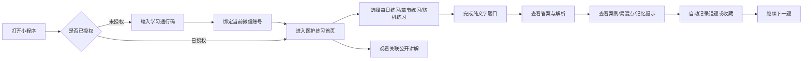

# MVP_SPEC.md

## 1. 当前阶段判断

本项目第一轮开发优先做专转本医护大类，高数板块仅保留后续占位。

原因：

- 医护内容以纯文字、描述性题干、知识点总结、案例材料、易混点和记忆提示为主，前后端数据结构更容易先跑通。
- 高数内容涉及 LaTeX 公式渲染、公式编辑、公式预览和移动端显示稳定性，第一轮不应把复杂度压到前端。
- 授权、题库、错题、视频资源、内容发布审核这些能力可以先在医护板块验证，后续再复用到高数。

当前代码状态：

- 小程序端：Taro + React + TypeScript，通过统一 service 层访问云函数网关或本地 API。
- 后台管理端：Ant Design Pro / Umi，通过统一 `adminFetch` 访问管理接口。
- 后端：NestJS + Prisma + SQLite，提供授权、内容、练习记录、收藏和后台发布接口。

第一阶段目标不是做完整教育平台，而是先完成医护方向的“授权后练习与复盘”闭环。

## 2. 产品定位

本项目定位为个人自学辅助小程序，用于学生进行医护考试复习、题库练习、知识点回顾、案例复盘、易混点辨析、记忆提示查看和公开讲解观看。

学生端不做成招生页、课程商城、培训机构官网或销售转化页。

禁止在学生端使用以下文案：

- 报名
- 招生
- 线下班
- 优惠
- 购买课程
- 课程套餐
- 培训机构
- 包过
- 保录取
- 提分承诺

推荐使用以下文案：

- 自学辅助
- 学习资源
- 医护考试复习
- 题库练习
- 公开讲解
- 解析复盘
- 案例材料
- 易混点
- 记忆提示
- 错题整理
- 学习通行码

医护内容必须定位为考试复习和自学辅助，不输出临床诊断、治疗建议、处方建议或现实医疗决策指导。

## 3. 第一轮 MVP 范围

第一轮只做医护板块。

核心闭环：

第一轮成功标准：

- 学生能通过微信登录并绑定唯一学习通行码。
- 授权用户能进入医护题库并完成题目练习。
- 未授权用户不能访问完整题库、答案解析、视频播放地址和个人学习记录。
- 题库入口和目录可以前置展示，但完整题干、答案、解析和视频地址必须受授权保护。
- 答错题目能进入错题本。
- 题目能关联知识点、案例材料、易混点、记忆提示和公开讲解。
- 后台能维护医护知识点、题目、案例材料、易混点、记忆提示、每日练习、公开视频和发布状态。

## 4. 当前后台模块映射

代码中已经暴露的医护后台模块应作为第一轮开发边界。

优先保留并接真实 API：

- 学生信息管理：用于查看学生账号、授权状态和学习记录摘要。
- 知识点管理：维护医护知识点和章节。
- 题目列表：维护题干、题型、难度、答案、解析、知识点标签。
- 题目导入：批量导入纯文字题目。
- 草稿清洗池：处理导入后的题目草稿、字段缺失和发布前检查。
- 案例材料管理：维护案例背景、关键词、分析重点和关联知识点。
- 易混点管理：维护两个概念的区别和对比总结。
- 记忆提示管理：维护口诀、记忆提示和关联知识点。
- 每日练习配置：配置每日推荐题目。
- 公开讲解管理：维护视频标题、时长、难度、关联知识点。
- 视频素材管理：维护视频文件、封面、来源和发布状态。
- 内容发布审核：审核题目、视频、案例、易混点和记忆提示。

第一轮不要新增大量后台模块。确实需要新增时，优先新增“授权码管理”，不要新增营销、订单、支付、转化类模块。

## 5. 学生端页面边界

第一轮学生端只保留 4 个底部 Tab：

- 练习：首页默认入口，突出继续练习、每日练习、随机练习、章节练习。
- 题库：按章节、知识点、难度筛选医护题目。
- 视频：展示与知识点或题目关联的公开讲解。
- 我的：授权状态、学习通行码、错题数量、收藏数量、基础设置。

不要增加第 5 个 Tab。

### 5.1 未授权页

未授权用户进入小程序后，只展示激活页。

页面内容：

- 标题：激活医护学习资源
- 说明：输入学习通行码后，可使用对应范围内的题库、解析、案例材料和公开讲解。
- 输入框：学习通行码
- 主按钮：立即激活
- 提示：一个通行码默认仅绑定一个微信账号。

未授权页禁止出现课程销售、购买、优惠、报名等引导。

### 5.2 练习首页

练习首页目标是让学生立刻进入练习，不做复杂信息看板。

允许模块：

- 授权状态：已激活 / 即将到期 / 未激活。
- 主按钮：继续练习。
- 快速入口：每日练习、随机练习、章节练习。
- 今日推荐：1 道医护题目或 1 个知识点。
- 近期错题：最多展示 3 条。
- 关联公开讲解：最多展示 1 到 2 个视频。
- 学习卡片：案例材料、易混点、记忆提示可以作为轻量入口。

禁止模块：

- 大面积运营 Banner。
- 复杂学习雷达图。
- 排行榜。
- 积分商城。
- 社区讨论。
- 付费转化入口。
- AI 助教入口。

### 5.3 题库页

题库页只服务检索和进入练习。

允许筛选：

- 章节
- 知识点
- 难度
- 题型
- 是否已做
- 是否错题

题库列表展示字段：

- 题目标题
- 难度
- 知识点标签
- 完成状态
- 错题状态

题库页不要做复杂卡片瀑布流，不要做大量装饰插图。

### 5.4 答题页

答题页必须优先保证文字可读性。

核心模块：

- 题干
- 选项或作答区域
- 知识点标签
- 提交答案
- 正确答案
- 解析复盘
- 案例材料入口
- 易混点入口
- 记忆提示入口
- 收藏
- 加入错题或自动错题记录
- 下一题
- 关联公开讲解入口

医护题干以纯文字为主，第一轮不要引入公式渲染、复杂富文本编辑器或重型内容渲染库。

### 5.5 视频页

视频页是辅助资源，不是首页主线。

允许模块：

- 视频列表
- 视频封面
- 标题
- 时长
- 难度
- 关联知识点
- 关联题目
- 播放页

视频文案建议使用“公开讲解、知识点讲解、题型讲解”，不要使用“试听课、购买课程、课程套餐”等表达。

### 5.6 我的页

核心模块：

- 微信用户信息
- 授权状态
- 已绑定通行码
- 有效期
- 可访问资源范围
- 刷题数量
- 错题数量
- 收藏数量
- 清理缓存或退出登录

我的页不要做销售承接页。

## 6. 题库前置与授权访问

本项目可以采用“题库入口前置，完整资源授权访问”的刷题小程序形态。

核心原则：

- 前端可以让学生先看到题库结构，降低进入练习的门槛。
- 前端不能把完整题库、答案库、解析库和视频播放地址明文裸放在小程序包内。
- 授权状态由后端确认，前端本地状态只用于 UI 展示。
- 前端隐藏按钮不是安全边界，所有受保护内容必须由后端校验。

### 6.1 未授权可展示内容

未授权状态允许展示低敏信息：

- 科目入口：第一轮只显示医护。
- 章节目录。
- 知识点目录。
- 题目数量。
- 难度标签。
- 题型标签。
- 公开的题库说明。
- 激活引导。

未授权状态不要展示过多样题，避免形成“可免费刷题”的误导。若需要展示样例题，最多展示 1 到 3 道公开样题，并明确标记为“公开样题”。

### 6.2 未授权禁止明文暴露内容

未授权状态不得明文暴露以下内容：

- 完整题干。
- 完整选项。
- 正确答案。
- 解析复盘。
- 案例材料全文。
- 易混点完整解释。
- 记忆提示全文。
- 视频播放地址。
- 视频资源真实 `fileKey`。
- 可批量导出的题库数据。
- 后端内部资源 ID 映射表。
- 任何可用于还原完整题库的数据包。

### 6.3 授权后访问规则

授权成功后，前端可以进入完整练习流程。

授权后允许访问：

- 完整题目。
- 选项。
- 答案。
- 解析复盘。
- 案例材料。
- 易混点。
- 记忆提示。
- 视频列表。
- 视频播放地址。
- 错题本。
- 收藏记录。
- 学习记录。

授权失败、过期、禁用、绑定他人账号时，统一回到学习通行码激活页。

### 6.4 推荐数据策略

MVP 阶段优先采用“目录前置 + 详情授权后请求”：

- 前端请求目录接口，展示章节、知识点、题目数量和难度分布。
- 用户点击进入练习时，前端请求授权状态。
- 授权通过后，再请求题目详情、答案、解析和关联视频。
- 授权未通过时，跳转激活页。

第一轮不要把完整题库打包进小程序端。

如果后续确实需要离线题库或本地缓存，必须采用加密题库包：

- 题库包必须加密。
- 解密 key 只能在授权成功后由后端下发。
- 解密 key 必须绑定用户、授权码、资源范围和题库版本。
- 禁止将通用解密 key 硬编码在小程序代码中。
- 禁止将完整答案库和完整解析库明文写入小程序包。

### 6.5 前端交互约束

前端应表现为纯粹刷题工具：

- 打开后优先看到“继续练习、每日练习、章节练习、随机练习”。
- 题库入口可以前置，但未授权时只展示目录和激活引导。
- 未授权用户点击题目、解析、案例、易混点、记忆提示或视频时，跳转激活页。
- 授权后直接进入刷题，不增加复杂欢迎页、营销页或多余引导。
- 授权状态刷新失败时，不允许默认放行，应提示重试或进入激活页。

## 7. 授权码机制

授权码必须由后端校验，不能只靠前端隐藏页面。

建议模型命名为 `LicenseToken`。

字段建议：

- `id`
- `code`
- `status`: `unused` | `bound` | `disabled` | `expired`
- `subjectScope`: 第一轮默认为 `nursing`
- `resourceScope`: `all` 或指定题库/视频/资源范围
- `maxBindCount`: MVP 默认 1
- `boundUserId`
- `boundOpenId`
- `boundAt`
- `expiresAt`
- `createdAt`
- `updatedAt`

绑定规则：

- 未使用授权码可以绑定当前微信账号。
- 已绑定同一账号时允许继续访问。
- 已绑定其他账号时拒绝访问。
- 禁用或过期授权码拒绝访问。
- 后台可以手动禁用、延期或重置绑定。

必须受保护的接口：

- 题库列表
- 题目详情
- 答案与解析
- 案例材料
- 易混点
- 记忆提示
- 视频列表
- 视频播放地址
- 错题本
- 收藏
- 学习记录

前端隐藏入口只作为体验优化，不作为安全边界。

## 8. 后端第一阶段模型

后端当前 MVP 使用 NestJS + Prisma + SQLite；后续数据规模扩大后再评估迁移 PostgreSQL。

第一阶段核心模型：

- `User`
- `LicenseToken`
- `UserAuthorization`
- `KnowledgePoint`
- `QuestionBank`
- `Question`
- `QuestionOption`
- `QuestionAnalysis`
- `CaseMaterial`
- `ConfusingPoint`
- `MemoryTip`
- `DailyPractice`
- `VideoLesson`
- `VideoAsset`
- `PracticeRecord`
- `Mistake`
- `Favorite`
- `ContentReview`

第一阶段接口：

- `POST /auth/wechat-login`
- `GET /me`
- `POST /license/activate`
- `GET /license/status`
- `GET /catalog`
- `GET /knowledge-points`
- `GET /question-banks`
- `GET /questions`
- `GET /questions/:id`
- `POST /practice-records`
- `GET /mistakes`
- `POST /favorites`
- `GET /case-materials`
- `GET /confusing-points`
- `GET /memory-tips`
- `GET /daily-practice`
- `GET /videos`
- `GET /videos/:id`

后台接口可使用 `/admin/*` 前缀，但必须保留权限控制入口。

目录接口说明：

- `GET /catalog` 可以在未授权状态下返回低敏目录信息。
- `GET /questions` 和 `GET /questions/:id` 必须根据授权状态控制返回字段。
- 未授权时不得返回完整题干、选项、答案、解析、案例、易混点、记忆提示和视频播放地址。
- 授权后才返回完整练习所需字段。

## 9. 管理端第一阶段

后台第一阶段目标是内容维护效率，不是强视觉表现。

必须优先实现：

- 授权码管理：生成、导出、禁用、延期、重置绑定。
- 学生授权状态：查看绑定账号、绑定时间、有效期、访问范围。
- 医护知识点管理。
- 医护题库管理。
- 医护题目导入。
- 草稿清洗池。
- 案例材料管理。
- 易混点管理。
- 记忆提示管理。
- 每日练习配置。
- 公开讲解管理。
- 视频素材管理。
- 内容发布审核。

第一阶段不要实现：

- 支付订单。
- 优惠券。
- 分销。
- 招生线索池。
- 直播课。
- 社区。
- 排行榜。
- 积分商城。
- 复杂 BI 看板。

## 10. UI 设计约束

学生端 UI 必须轻快、明亮、干净，不要做重色块、厚重卡片和复杂装饰。

视觉方向：

- 主色：青蓝、蓝绿色、薄荷绿。
- 背景：米白、浅灰、浅蓝、浅绿。
- 强调色：少量温和橙色或浅黄色。
- 卡片：轻阴影、低饱和、圆角适中。
- 文本：深青灰或深蓝灰，避免纯黑大面积压迫。
- 图标：线性或轻量面性图标，不要厚重拟物风。

禁止的视觉方向：

- 大面积深蓝、深绿、黑色背景。
- 大面积红色、金色、促销风。
- 高对比重阴影。
- 教育营销落地页风格。
- 首页堆满入口。
- 卡片层级过多。
- 为了视觉效果牺牲文字可读性。

交互原则：

- 首页必须能一键进入练习。
- 学生进入后 3 秒内应能知道下一步做什么。
- 单屏核心操作不要超过 2 个主按钮。
- 题目、解析、案例、易混点的字号和行距优先级高于装饰元素。
- 视频资源作为辅助入口，不压过练习主线。
- 未授权页只做激活，不做营销转化。
- Tab 不超过 4 个。
- 每个页面只保留一个主要目标。

## 11. 开发顺序

建议按以下顺序推进：

1. 建真实后端骨架和数据库模型，第一阶段只覆盖医护。
2. 实现微信登录、用户表、授权码表和授权校验中间件。
3. 实现低敏目录接口 `GET /catalog`，用于未授权状态展示章节、知识点和题量。
4. 实现医护知识点、题库、题目、解析、案例、易混点、记忆提示和视频的授权 API。
5. 改造小程序为“医护练习首页 + 题库目录前置 + 授权拦截”。
6. 实现授权码绑定页。
7. 实现医护答题页、解析复盘、错题本和收藏。
8. 后台加入授权码管理。
9. 后台医护题库、案例、易混点、记忆提示、视频资源接真实 API。
10. 加入内容发布审核。
11. 再补学习记录和基础统计。
12. 医护闭环稳定后，再开始高数公式和 LaTeX 相关能力。

在授权、医护题库、练习、解析、错题、视频资源闭环完成前，不要投入复杂原型、复杂看板、AI 助教或营销功能。

## 12. 给 Codex / Claude Code 的执行约束

执行本项目时必须遵守：

- 如果用户要求“做小程序前端”，第一轮默认做医护，不要主动扩展高数。
- 高数相关页面、公式渲染、LaTeX 编辑、公式预览暂缓，除非用户明确恢复高数开发。
- 优先实现授权刷题闭环，而不是扩展复杂首页。
- 不要把后台 Ant Design 组件搬到小程序端。
- 小程序端不得使用 `window`、`document`、`localStorage`。
- 服务端数据请求使用 service 层封装，不要在页面里硬编码 mock。
- 登录态和授权状态可以进入 Zustand；题目列表、视频列表、案例材料、易混点、记忆提示等服务端数据应优先使用 TanStack Query。
- 未授权访问必须由后端拒绝，前端只负责体验提示。
- 题库入口和目录可以前置展示，但完整题干、选项、答案、解析、案例、易混点、记忆提示和视频地址不得在未授权状态下暴露。
- 不要把完整题库、答案库、解析库或通用解密 key 明文写进小程序包。
- MVP 优先使用“目录前置 + 详情授权后请求”，不要默认做本地完整题库包。
- 如果未来做本地题库包，必须加密，并由后端在授权成功后下发绑定用户和版本的解密 key。
- 视频资源要与章节、知识点、题目关联，不要做成独立营销视频页。
- 案例材料、易混点、记忆提示是医护第一轮的重要学习卡片，不要误删。
- 每次新增功能前先判断是否服务于“医护授权后练习与复盘”闭环。
- UI 默认采用轻快明亮风格，不要使用厚重色块、大面积深色背景和促销视觉。
- 不要默认加入支付、订单、优惠券、直播、社区、排行榜、积分商城。
- 不要输出临床诊疗建议；医护内容只作为考试复习和自学辅助。
