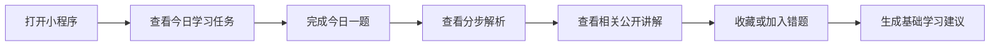
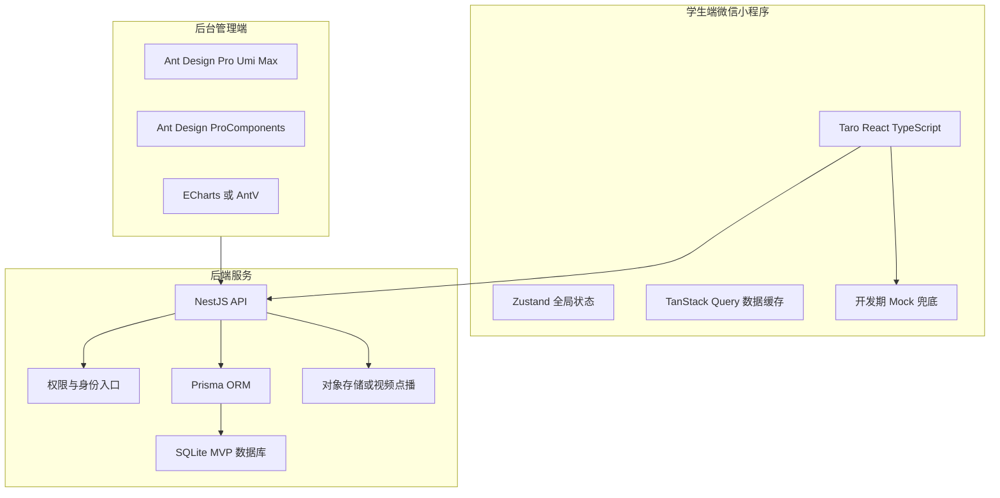
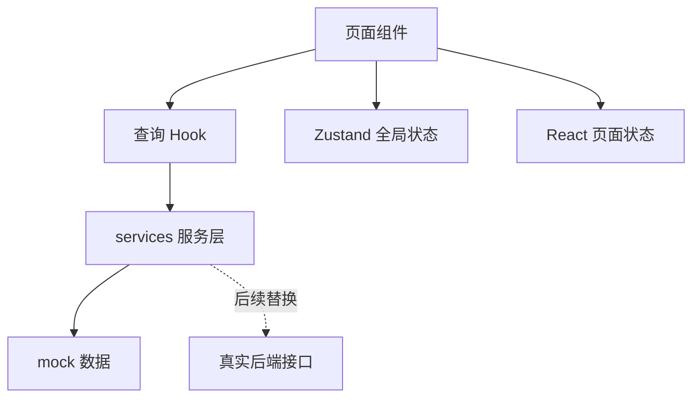
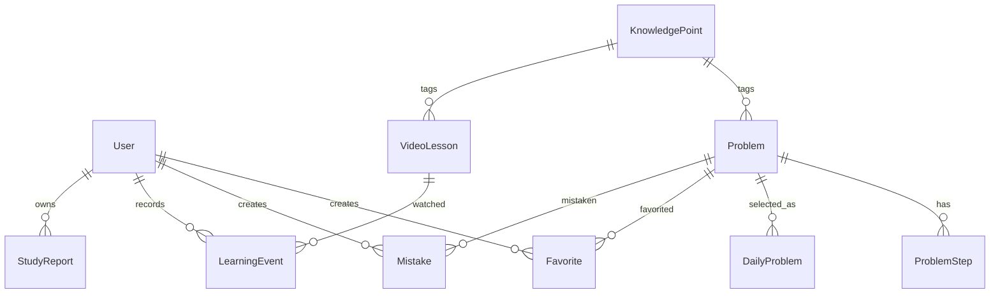

# 项目总体架构规划

本文件用于描述“专转本医护大类自学辅助微信小程序 + 后台管理系统 + 后端服务”的总体架构、边界、模块拆分和实施顺序。高数仅保留为后续占位方向，当前 MVP 以医护大类为主。项目执行时应同时遵守 [`SKILLS.md`](SKILLS.md) 中的技术栈、约束、文案规范和验收标准。

## 1. 项目定位

本项目定位为“专转本医护大类自学辅助工具”，服务于医护方向学生的自学复习、每日练习、公开讲解观看、错题收藏和基础学习建议生成。

第一版只验证以下 MVP 闭环：



项目不应主动扩展为招生页、课程商城、培训机构官网，也不应在 MVP 阶段引入支付、订单、优惠券、分销、直播、社区、排行榜、积分商城或 AI 助教。

## 2. 总体技术架构



### 2.1 学生端

学生端优先使用：

- Taro
- React
- TypeScript
- Zustand
- TanStack Query
- Sass 或 CSS Modules
- 微信小程序原生组件能力

学生端负责：

- 展示今日学习任务
- 展示题目、知识点标签、提示、答案、分步解析和易错点
- 展示公开讲解与视频详情
- 管理错题与收藏入口
- 展示基础学习报告和学习建议
- 记录学习行为事件的前端触发点

学生端不负责：

- 后台内容管理
- 复杂权限配置
- 支付、订单、优惠券、营销活动
- 在组件内部长期硬编码 mock 数据
- 使用浏览器 DOM API 或 Web 本地存储 API

### 2.2 后台管理端

后台管理端优先使用：

- Ant Design Pro / Umi Max
- Ant Design
- ProComponents
- ECharts 或 AntV

后台管理端负责：

- 知识点管理
- 题目管理
- 每日一题配置
- 微课管理
- 视频素材管理
- 内容发布审核
- 基础学习数据看板

后台管理端不追求强视觉表现，优先保证老师或助教的内容维护效率。

### 2.3 后端服务

后端优先使用：

- NestJS
- SQLite（MVP 阶段）
- Prisma
- 腾讯云 COS / 云点播，或阿里云 OSS / 视频点播

后端负责：

- 面向小程序的页面聚合接口
- 面向后台的内容 CRUD 接口
- 内容状态流转
- 学习事件记录
- 基础学习报告生成
- 文件与视频素材元数据管理
- 权限控制入口

MVP 阶段不默认引入 Redis、消息队列、微服务、AI 助教或复杂推荐系统。

## 3. 仓库与目录规划

当前目录是微信小程序项目根目录，已有微信开发者工具配置文件：

- [`project.config.json`](project.config.json)
- [`project.private.config.json`](project.private.config.json)
- [`SKILLS.md`](SKILLS.md)

建议先将当前目录作为小程序端工程根目录使用，第一阶段只补齐小程序端 Taro 工程。后续如需接入后台与后端，可演进为以下结构：

```text
.
├── project.config.json
├── project.private.config.json
├── SKILLS.md
├── PROJECT_ARCHITECTURE.md
├── package.json
├── pnpm-lock.yaml
├── config/
├── src/
│   ├── app.config.ts
│   ├── app.tsx
│   ├── app.scss
│   ├── pages/
│   ├── components/
│   ├── mock/
│   ├── services/
│   ├── stores/
│   ├── types/
│   ├── styles/
│   └── assets/
└── dist/
    └── weapp/
```

当后台与后端启动后，可考虑两种演进方式：

### 3.1 单仓多应用

```text
.
├── apps/
│   ├── miniapp/
│   ├── admin/
│   └── api/
├── packages/
│   └── shared-types/
├── docs/
└── package.json
```

优点：类型共享方便、统一依赖管理、适合长期维护。

风险：当前目录已经有微信小程序配置，迁移到单仓结构时需要重新处理微信开发者工具导入路径和 Taro outputRoot。

### 3.2 分阶段独立目录

```text
.
├── miniapp-current-root
├── admin
└── api
```

优点：对当前小程序目录影响较小，初始化风险低。

风险：跨端共享类型和接口契约需要额外同步机制。

MVP 阶段建议先采用当前目录作为小程序端根目录，等学生端闭环稳定后再决定是否升级为单仓结构。

## 4. 小程序端模块规划

### 4.1 页面优先级

按照 [`SKILLS.md`](SKILLS.md) 的约束，小程序端页面优先级为：

1. 首页
2. 今日一题详情页
3. 微课列表页
4. 视频播放页
5. 知识点地图页
6. 错题收藏页
7. 学习报告页
8. 我的页面

底部 Tab：

- 首页
- 题库
- 微课
- 我的

### 4.2 建议页面结构

```text
src/pages/
├── home/
│   ├── index.tsx
│   ├── index.config.ts
│   └── index.module.scss
├── problem-detail/
├── problem-bank/
├── lessons/
├── lesson-detail/
├── knowledge-map/
├── mistakes/
├── report/
└── profile/
```

### 4.3 组件规划

必须优先拆分以下组件：

- ProblemCard
- SolutionSteps
- KnowledgeTag
- VideoCard
- ProgressRing
- MistakeCard
- ReportCard
- EmptyState
- SafeAreaView

建议目录：

```text
src/components/
├── ProblemCard/
├── SolutionSteps/
├── KnowledgeTag/
├── VideoCard/
├── ProgressRing/
├── MistakeCard/
├── ReportCard/
├── EmptyState/
└── SafeAreaView/
```

### 4.4 数据与状态规划



状态划分：

- 页面内临时交互状态：React state
- 登录态、用户信息、全局设置：Zustand
- 服务端数据请求、缓存、刷新：TanStack Query
- 题目、微课、报告等列表数据：不要长期塞入全局 store

建议目录：

```text
src/types/
src/mock/
src/services/
src/stores/
```

## 5. 后台管理端模块规划

后台管理优先模块：

1. 知识点管理
2. 题目管理
3. 每日一题配置
4. 微课管理
5. 视频素材管理
6. 内容发布审核
7. 基础学习数据看板

建议后台路由：

```text
/admin/knowledge-points
/admin/problems
/admin/daily-problems
/admin/video-lessons
/admin/assets
/admin/reviews
/admin/dashboard
```

后台表单和列表应围绕内容维护效率设计，避免营销化页面。

## 6. 后端领域模型规划

核心模型优先级：



核心模型：

- User
- KnowledgePoint
- Problem
- ProblemStep
- VideoLesson
- DailyProblem
- Favorite
- Mistake
- LearningEvent
- StudyReport

学习事件枚举：

- OPEN_APP
- VIEW_PROBLEM
- SUBMIT_PROBLEM
- VIEW_SOLUTION
- FAVORITE_PROBLEM
- ADD_MISTAKE
- WATCH_VIDEO
- COMPLETE_VIDEO
- VIEW_REPORT

## 7. API 分层规划

### 7.1 小程序端接口

小程序接口应返回面向页面的数据，避免暴露后台内部字段。

建议接口：

```text
GET /miniapp/home
GET /miniapp/daily-problem
GET /miniapp/problems/:id
POST /miniapp/problems/:id/submit
POST /miniapp/problems/:id/favorite
POST /miniapp/problems/:id/mistake
GET /miniapp/video-lessons
GET /miniapp/video-lessons/:id
GET /miniapp/knowledge-map
GET /miniapp/mistakes
GET /miniapp/study-report
POST /miniapp/learning-events
```

### 7.2 后台管理接口

后台接口可以更完整，但必须预留权限控制入口。

建议接口：

```text
/admin/knowledge-points
/admin/problems
/admin/daily-problems
/admin/video-lessons
/admin/assets
/admin/reviews
/admin/dashboard
```

## 8. 内容状态与审核规划

内容状态统一使用：

- draft：草稿
- published：已发布
- offline：已下线

题目、微课、每日一题配置都应支持状态流转。小程序端只展示 published 状态内容。

## 9. 样式与体验规范

小程序端样式方向：

- 主色：蓝绿色 / 青蓝色
- 背景：米白 / 浅灰 / 低饱和色
- 强调色：少量橙色
- 数学内容优先保证行距、字号、留白和移动端可读性
- 首页不堆满入口
- 不做教育营销落地页

文案应使用：

- 公开讲解
- 自学辅助
- 知识点陪练
- 学习建议
- 复习计划
- 能力诊断
- 错题整理
- 学习资源

禁止使用招生、报名、优惠、购买课程、培训机构、包过、保录取、提分承诺等销售和承诺类表述。

## 10. 初始化策略

当前目录适合继续作为小程序工程根目录，但不建议直接执行覆盖式脚手架初始化。

推荐策略：

1. 保护现有 [`project.config.json`](project.config.json)、[`project.private.config.json`](project.private.config.json)、[`SKILLS.md`](SKILLS.md) 和本文件。
2. 补齐 Taro + React + TypeScript + pnpm 工程基础文件。
3. 建立 src 目录与最小首页。
4. 建立 mock、types、services、stores、styles 等目录骨架。
5. 确认 Taro 构建产物目录与微信开发者工具项目配置兼容。
6. 第一轮只验证最小可运行，不实现完整业务闭环。

## 11. 分阶段实施路线

### 阶段一：小程序基础工程

目标：让当前目录成为可维护、可构建的 Taro 微信小程序工程。

输出：

- package.json
- pnpm 配置与锁文件
- Taro config
- TypeScript 配置
- src/app.tsx
- src/app.config.ts
- src/pages/home 最小首页
- src/components、src/mock、src/services、src/types、src/stores、src/styles 基础目录

### 阶段二：学生端静态 MVP

目标：使用本地 mock 数据完成学生端核心页面和跳转。

输出：

- 首页
- 今日一题详情页
- 微课列表页
- 视频播放页
- 知识点地图页
- 错题收藏页
- 学习报告页
- 我的页面
- 核心组件拆分

### 阶段三：后台管理 MVP

目标：让老师或助教可以维护 MVP 内容。

输出：

- 知识点管理
- 题目管理
- 每日一题配置
- 微课管理
- 视频素材管理
- 内容发布审核
- 基础学习数据看板

### 阶段四：后端与真实接口

目标：建立 NestJS + Prisma + SQLite 后端，用真实接口替换小程序生产数据源；mock 仅作为开发期显式兜底。

输出：

- 数据模型
- 小程序聚合接口
- 后台 CRUD 接口
- 学习事件记录
- 基础学习报告生成

### 阶段五：素材、统计与优化

目标：接入视频上传、对象存储、统计看板和性能优化。

输出：

- 视频封面与文件元数据管理
- 对象存储或视频点播接入
- 基础数据看板
- 列表分页与懒加载
- 数学内容展示优化

## 12. 当前下一步执行计划

在进入代码实现前，建议只执行以下最小范围：

- 保留现有微信开发者工具配置。
- 补齐小程序端 Taro 工程骨架。
- 使用 pnpm 作为包管理。
- 初始化 React + TypeScript 入口。
- 创建最小首页和基础 app 配置。
- 预留 components、mock、services、types、stores、styles 目录。
- 不实现后台管理。
- 不实现后端服务。
- 不接真实接口。
- 不引入大型 UI 库。
- 不加入营销化文案。

该计划的验收标准：

- 当前目录结构清晰。
- 项目依赖与 Taro 技术栈一致。
- 现有微信开发者工具配置未被破坏。
- 小程序端没有 DOM、window、document、localStorage 依赖。
- 后续接入学生端 MVP 页面时不需要推倒重来。
